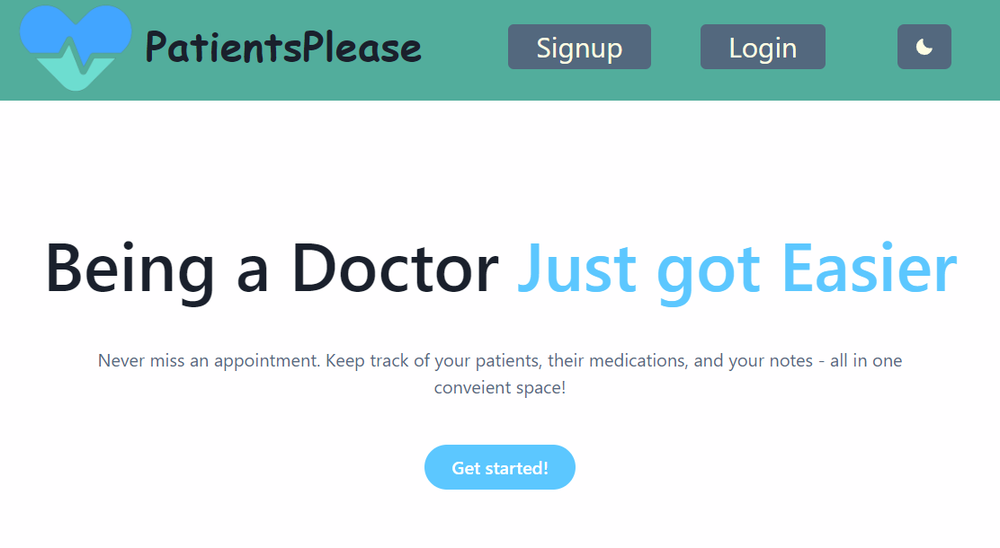
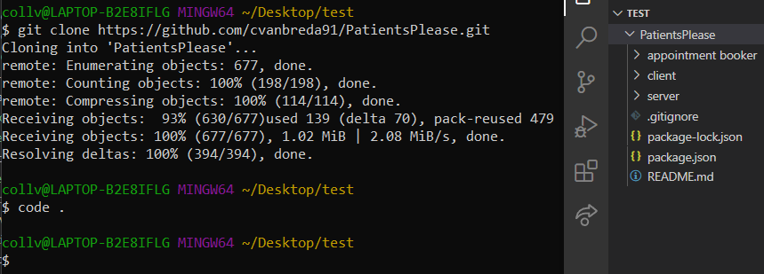
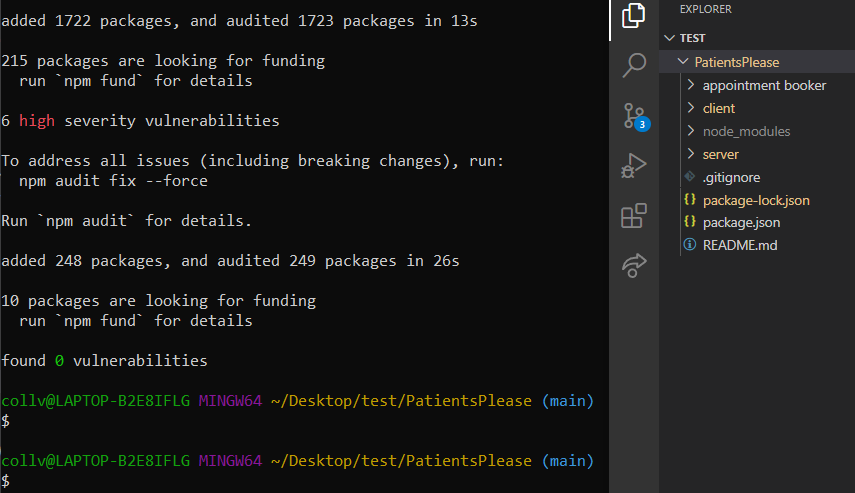
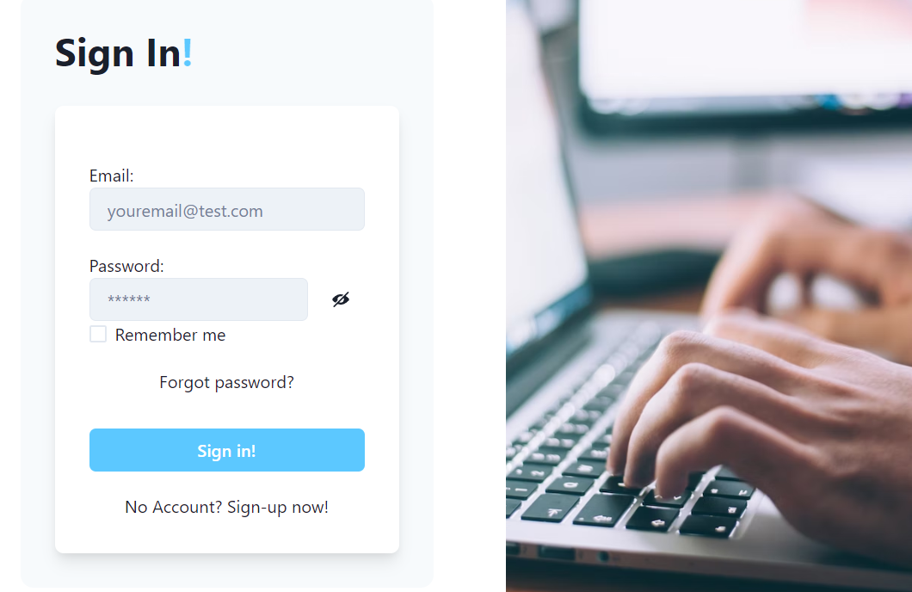

# Patients Please

## Description

Patients Please is a MERN Full Stack single-page application for a doctor's office. Patients Please helps doctors stay organized by: 

- keeping track of their appointment schedule
- displaying their patients information along with the doctor's notes
- providing an inventory of the drugs in the doctor's office with a description

Patients Please perfectly pleases patients by: 

- schedule doctor's appointments online and view your appointment schedule
- provides useful information on prescription drugs

## Table of Contents

- [Installation](#installation)
- [Usage](#usage)
- [Credits](#credits)
- [License](#license)

## Installation

To Install and begin developing the Patients Please project follow these easy steps:

1. Open command line at the directory you would like to clone the repo
2. Enter the following command to create a clone of the AutoAuto Repo: '<b>git clone https://github.com/cvanbreda91/PatientsPlease.git</b>'
3. Enter the following command to open the project in the Visual Studios development environment: '<b>code .</b>'

4. The project will still need to install the required node packages. Enter the following command to change directory to the newly cloned Patients Please project: '<b>cd PatientsPlease</b>' 
5. Now that you are in the correct directory, install the node packages with the following command: '<b>npm install --legacy-peer-deps</b>'.

6. Enter the following command to seed the project with doctor and patient data: '<b>npm run seed</b>'
7. The project is now ready to be run! Enter the following command to open Patients Please in GraphQL: '<b>npm start</b>'

## Usage

To run the Patients Please application open the projects main folder in command line, then enter the command: '<b>npm run develop</b>'

## Credits

Collaborators: 
- Courtney Van Breda [Git Hub](https://github.com/cvanbreda91)
- Saheb Bhalla [Git Hub](https://github.com/sahebbhalla)
- Mustapha Taylor [Git Hub](https://github.com/mtaylo1)
- Cindy Xin Wang [Git Hub](https://github.com/CindyX1109)
- Justin Collver [Git Hub](https://github.com/threewide)
- Thiago Borges Nasciutti
- Antonio Rodrigo

Guide's:
- Rich Widtmann [Professional README Guide](https://coding-boot-camp.github.io/full-stack/github/professional-readme-guide)
- Choose a License [MIT License Template](https://choosealicense.com/licenses/mit/)
- Drugsite Limited [Drug Information](https://www.drugs.com/drug_information.html)

## License

Copyright (c) [2022] [Patients Please]

Permission is hereby granted, free of charge, to any person obtaining a copy
of this software and associated documentation files (the "Software"), to deal
in the Software without restriction, including without limitation the rights
to use, copy, modify, merge, publish, distribute, sublicense, and/or sell
copies of the Software, and to permit persons to whom the Software is
furnished to do so, subject to the following conditions:

The above copyright notice and this permission notice shall be included in all
copies or substantial portions of the Software.

THE SOFTWARE IS PROVIDED "AS IS", WITHOUT WARRANTY OF ANY KIND, EXPRESS OR
IMPLIED, INCLUDING BUT NOT LIMITED TO THE WARRANTIES OF MERCHANTABILITY,
FITNESS FOR A PARTICULAR PURPOSE AND NONINFRINGEMENT. IN NO EVENT SHALL THE
AUTHORS OR COPYRIGHT HOLDERS BE LIABLE FOR ANY CLAIM, DAMAGES OR OTHER
LIABILITY, WHETHER IN AN ACTION OF CONTRACT, TORT OR OTHERWISE, ARISING FROM,
OUT OF OR IN CONNECTION WITH THE SOFTWARE OR THE USE OR OTHER DEALINGS IN THE
SOFTWARE.